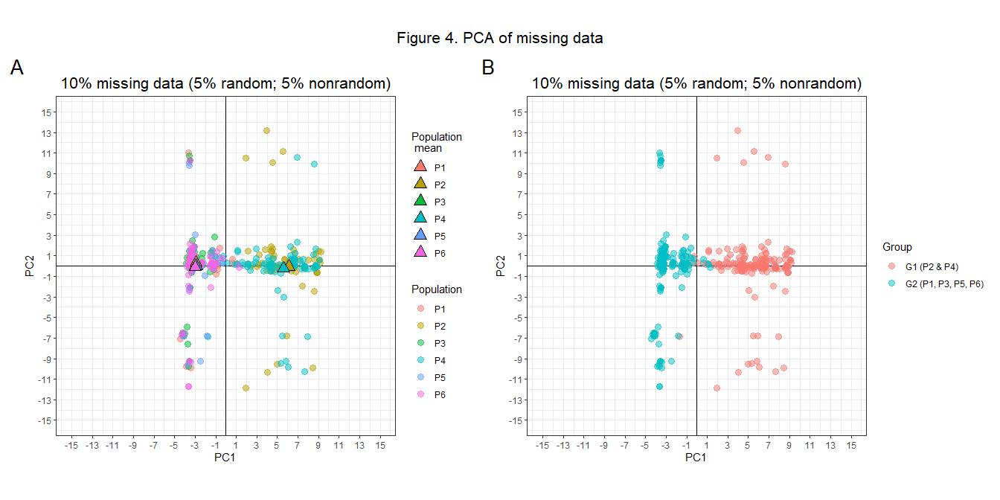

# Nonrandom missing data in population genetics analysis (and how to correct it)
<br>

<font size="7">
Marc A. Beer
</font>
<br>

<font size="7">
02/16/2023
</font>

<br><br>

<font size="5"> The randomness (or lack thereof) of missing data is
an important consideration for analysis. Population genetic datasets
frequently contain missing genotypes due to variation in sequencing
quality across genetic loci and individual samples. When these missing
data are random with respect to key characteristics of the data (e.g.,
with respect to samples’ geographic regions of origin), we expect that
they will lead to little distortion to the patterns we study; we will
see a demonstration of this in just a moment. However, when data are
missing not at random (MNAR), genetic relationships among samples can
indeed become distorted and adversely affect inference. A more thorough
treatment of random and non-random missing data can be found at a
wonderful series of webpages by Stef van Buuren
(<https://stefvanbuuren.name/fimd/sec-MCAR.html>) </font> <br>

<font size="5"> You might be wondering why genetic data MNAR might
occur. What might lead to a correlation between missing data and some
characteristics of our samples? One example is the improper
randomization of samples into multiplexed sequencing libraries. If we
sample individuals from six populations and treat each population’s
samples separately (i.e., when preparing sequencing libraries and/or
carrying out sequencing itself), nonrandomness in missing data or other
nonrandom aberrations may result. In this case, some sequencing runs may
go poorly, leading to poor sequencing depth and missing data that is
correlated with samples’ populations of origin; this misfortune could
have been avoided by randomizing samples into sequencing libraries with
respect to population of origin. Another case that is salient to
reduced-representation sequencing is inter-population restriction site
polymorphism. Some populations may lack restriction sites that are
present in other populations. The former populations would have
completely missing data at loci that are otherwise genotyped in other
populations. </font> <br>

<font size="5"> Okay, the potential for genetic data MNAR are clearly
present, but besides some nebulous warning that it can cause distortion,
should we really care? In this walkthrough, I’ll show you how data MNAR
can distort inference from a common population genetic analysis:
principal components analysis (PCA). Then, I’ll show you how to remedy
the problem using a related analysis, discriminant analysis of principal
components (DAPC). </font> <br>

<font size="5"> Let’s start by loading in some packages. One of these is
adegenet, which contains numerous functions for carrying out population
genetics analyses, including PCA and DAPC. Handily, it also includes
genetic datasets that we can use as examples. </font>

``` r
library(adegenet)
library(dplyr)
library(knitr)
library(ggplot2)
library(patchwork)
library(rmarkdown)
```

<br>

## 1. Load in a population genetic dataset

<br> <font size="5"> The package adegenet contains several genetic
datasets, and we will use one as an example. Let’s load in a dataset
containing genotypes for 30 microsatellite loci for 600 diploid
individuals from six populations simulated under an island model. Much
of this walkthrough will involve the locus/allele matrix stored in the
tab subset of the dataset. If you are less familiar with genind objects,
take a few minutes to look through some of the data object’s
subcomponents. Let’s visualize the locus/allele matrix below. Rows are
individual samples and each column refers to a locus and one of its
alleles. E.g., column names loc-1.03 and loc-1.19 refer to two different
alleles at locus 1; entries in the matrix indicate how many copies of
given allele are present (ranging from 0 to 2). Your own datasets may
look different: while some of the microsatellite loci in this example
dataset have many alleles, the SNPs typical of modern genomic datasets
often have only two (and thus biallelic loci uniformly will only have
two columns per locus). </font> <br>

``` r
#####
#load in example data distributed with adegenet
##in genind format, which is useful for our purposes
data(dapcIllus)

#we'll use only the first dataset
data <- dapcIllus$a

#isolating the genotype matrix
data_tab <- data$tab

#rows are individuals while columns record the presence/absence of a given allele for a codominant locus
#notice that column names refer to a locus (e.g., loc-1 or loc-2) followed by the allele of interest
#(e.g., loc-1.03 and loc-1.19 refer to two different alleles at locus 1)
#for biallelic loci, such as SNPs, there will uniformly be only two columns per locus
kable(data_tab[1:5,1:10])
```

| loc-1.03 | loc-1.19 | loc-2.01 | loc-2.04 | loc-2.40 | loc-2.41 | loc-2.44 | loc-3.08 | loc-3.10 | loc-3.38 |
|---------:|---------:|---------:|---------:|---------:|---------:|---------:|---------:|---------:|---------:|
|        1 |        1 |        0 |        0 |        1 |        0 |        1 |        0 |        2 |        0 |
|        1 |        1 |        0 |        0 |        2 |        0 |        0 |        0 |        2 |        0 |
|        1 |        1 |        0 |        0 |        1 |        0 |        1 |        0 |        2 |        0 |
|        2 |        0 |        0 |        0 |        0 |        0 |        2 |        0 |        0 |        0 |
|        1 |        1 |        0 |        0 |        1 |        0 |        1 |        0 |        1 |        0 |

<br>

<font size="5"> Note that this is a complete dataset - there are no
missing data. We will introduce missing data both randomly and
nonrandomly to demonstrate their effects on results from principal
components analysis (PCA). To get a baseline understanding of the
complete dataset, let’s run PCA on it now. </font>

``` r
#run PCA on the complete dataset
data_pca <- dudi.pca(data, center=TRUE, scale=TRUE, scannf=FALSE, nf=2)

#summarize PC coordinates by population
pc_pop <- data.frame(pop=data$pop, data_pca$li)
pc_pop_summ <- pc_pop %>%
  group_by(pop) %>%
  summarise(pc1_mean=mean(Axis1), pc2_mean=mean(Axis2))

#plot results
p_fulldata <- ggplot()+
  geom_vline(xintercept=0)+
  geom_hline(yintercept=0)+
  geom_point(data_pca$li, mapping=aes(x=Axis1, y=Axis2, colour=data$pop), size=3, alpha=0.5)+
  geom_point(pc_pop_summ, mapping=aes(x=pc1_mean, y=pc2_mean, fill=pop), colour="black", shape=24, size=4)+
    labs(x="PC1", y="PC2", colour="Population", fill="Population \n mean", title = "Full dataset (0% missing data)")+
  scale_y_continuous(limits=c(-10, 10), breaks=seq(from=-10, to=10, by=2))+
  scale_x_continuous(limits=c(-10, 10), breaks=seq(from=-10, to=10, by=2))+
  theme(aspect.ratio=1)+
  coord_fixed()+
  theme_bw()
```

<br>

<font size="5"> The results of PCA are visualized below. Individuals
from different populations (coloured points) clearly cluster together.
Noteworthy is the relatively large distance between populations P2 and
P4 along PC2 (the vertical axis). The relationship between these two
populations will be used to understand how random and nonrandom missing
data can impact our inference </font>

<br>

## 2. Data missing at random

<br>

<font size="5"> Before investigating nonrandom missing data, let’s start
with the best-case scenario of random missing data. </font> <br>

<font size="5"> We will convert the genotypes of 20% (6) of the loci to
missing data for 50% (150) of the individuals, leading to a missing data
rate of 10% in terms of a genotype matrix; note that this percentage
should be roughly the same in terms of the tab matrix in the genind
object, with some variation since loci can have different numbers of
alleles. The code is shown and annotated below, but briefly, we first
randomly select 20% of the loci, and then for each of those loci, we
randomly select 50% of the individuals to have missing data. We will
repeat this process selecting 80% of the loci and 50% of the
individuals, leading to a missing data rate of 40%. Thus, we have
randomly introduced two different magnitudes of missing data in a way
that is uncorrelated with properties of our samples (e.g., their
populations of origin). If we wanted, we could introduce missing data
more uniformly across loci, but the above procedure is sufficient for
our purposes. </font>

``` r
###
#simulate random missing data (10%)

#save a copy of the data_tab to modify
data_random <- data
data_tab_random <- data_tab

#we will select 20% of the loci to add missing data to
set.seed(100)
loc_select <- sample(x=levels(data$loc.fac),
              size=round(0.20*length(levels(data$loc.fac)), digits=0),
              replace=FALSE
              )

#for each locus, we will randomly select 50% of individuals (i.e., 150 individuals) to introduce missing data to
for (i in 1:length(loc_select)){
  
  #randomly sample from all the individuals in the dataset
  set.seed(100+i)
  ind <- sort(sample(x=rownames(data$tab),
                size=round(0.50*length(rownames(data$tab)), digits=0),
                replace=FALSE
          ),
          decreasing=FALSE)
  
  #for the current locus, replace genotypes of randomly selected individuals with NA values
  data_tab_random[ind, which(data$loc.fac==loc_select[i])] <- NA
}

###
#simulate random missing data (40%)

#save a copy of the data_tab to modify
data_random_040 <- data
data_tab_random_040 <- data_tab

#we will select 80% of the loci to add missing data to
set.seed(100)
loc_select <- sample(x=levels(data$loc.fac),
                     size=round(0.8*length(levels(data$loc.fac)), digits=0),
                     replace=FALSE
)

#for each locus, we will randomly select 50% of individuals (i.e., 300 individuals) to introduce missing data to
for (i in 1:length(loc_select)){
  
  #randomly sample from all the individuals in the dataset
  set.seed(100+i)
  ind <- sort(sample(x=rownames(data$tab),
                     size=round(0.5*length(rownames(data$tab)), digits=0),
                     replace=FALSE
  ),
  decreasing=FALSE)
  
  #for the current locus, replace genotypes of randomly selected individuals with NA values
  data_tab_random_040[ind, which(data$loc.fac==loc_select[i])] <- NA
}
```

<br>

<font size="5"> Let’s conduct PCA on the modified datasets. Note that
PCA requires complete data, so we will first fill in the now-missing
data using mean value imputation. The code below both imputes missing
data and carries out PCA. </font>

``` r
#re-do PCA to see effects

###
#10% missing data

#insert tab with missing data back into the genind object
data_random$tab <- data_tab_random

#note that there cannot be missing entries in PCA, so we will impute the now-missing data
data_random_imputed <- scaleGen(x=data_random, center=TRUE, scale=TRUE, NA.method="mean")

#run the PCA
data_random_pca <- dudi.pca(data_random_imputed, center=TRUE, scale=TRUE, scannf=FALSE, nf=2)

#summarize PC coordinates by population
pc_random_pop <- data.frame(pop=data$pop, data_random_pca$li)
pc_random_pop_summ <- pc_random_pop %>%
  group_by(pop) %>%
  summarise(pc1_mean=mean(Axis1), pc2_mean=mean(Axis2))

p_random <- ggplot()+
  geom_vline(xintercept=0)+
  geom_hline(yintercept=0)+
  geom_point(data_random_pca$li, mapping=aes(x=Axis1, y=Axis2, colour=data$pop), size=3, alpha=0.5)+
  geom_point(pc_random_pop_summ, mapping=aes(x=pc1_mean, y=pc2_mean, fill=pop), colour="black", shape=24, size=4)+
  labs(x="PC1", y="PC2", colour="Population", fill="Population \n mean", title = "10% random missing data")+
  scale_y_continuous(limits=c(-10, 10), breaks=seq(from=-10, to=10, by=2))+
  scale_x_continuous(limits=c(-10, 10), breaks=seq(from=-10, to=10, by=2))+
  theme(aspect.ratio=1)+
  coord_fixed()+
  theme_bw()

###
#40% missing data

#insert tab with missing data back into the genind object
data_random_040$tab <- data_tab_random_040

#note that there cannot be missing entries in PCA, so we will impute the now-missing data
data_random_040_imputed <- scaleGen(x=data_random_040, center=TRUE, scale=TRUE, NA.method="mean")

#run the PCA
data_random_040_pca <- dudi.pca(data_random_040_imputed, center=TRUE, scale=TRUE, scannf=FALSE, nf=2)

#summarize PC coordinates by population
pc_random_040_pop <- data.frame(pop=data$pop, data_random_040_pca$li)
pc_random_040_pop_summ <- pc_random_040_pop %>%
  group_by(pop) %>%
  summarise(pc1_mean=mean(Axis1), pc2_mean=mean(Axis2))

p_random_040 <- ggplot()+
  geom_vline(xintercept=0)+
  geom_hline(yintercept=0)+
  geom_point(data_random_040_pca$li, mapping=aes(x=Axis1, y=Axis2, colour=data$pop), size=3, alpha=0.5)+
  geom_point(pc_random_040_pop_summ, mapping=aes(x=pc1_mean, y=pc2_mean, fill=pop), colour="black", shape=24, size=4)+
    labs(x="PC1", y="PC2", colour="Population", fill="Population \n mean", title = "40% random missing data")+
  scale_y_continuous(limits=c(-10, 10), breaks=seq(from=-10, to=10, by=2))+
  scale_x_continuous(limits=c(-10, 10), breaks=seq(from=-10, to=10, by=2))+
  theme(aspect.ratio=1)+
  coord_fixed()+
  theme_bw()
```

<br>

<font size="5"> The results of PCA on the two imputed datasets are shown
below (panels B and C), adjacent to the original PCA we conducted on the
complete, unimputed dataset (Panel A). At a respectable missing data
rate of 10%, the broad patterns are largely undistorted. Even the
missing data rate of 40% captures most of the patterns found in the
complete dataset. </font> <br>

<font size="5"> However, you might notice that individual PC scores, as
well as population means, are shifted towards the graph origin;
distances between population means have accordingly decreased. This
“collapse” towards the origin is a symptom of mean value imputation, and
the obscuration of the true patterns becomes more extreme with
increasing missing data. More sophisticated imputation methods (such as
one based on snmf in the R package LEA) may combat this distortion.
Indeed, it would be fair to say that the observed distortion is a
consequence of both missing data and imputation. In general, however,
the effects of random missing data are rather mild because individuals
of all populations are affected similarly. </font>


<br>

## 2. Data missing not-at-random

<br>

<font size="5"> Now that we have seen the relatively mild effects of
random missing data, let’s investigate nonrandom missing data. </font>
<br>

<font size="5"> The process for introducing nonrandom missing data is a
little bit different. As in the first random missing data simulation, we
will keep the total missing data at 10%, but half of it will be random
and half nonrandom with respect to population. First, we introduce
missing data at 20% of the loci for 150 individuals (25% of the total
individuals); these individuals will be **randomly sampled from
populations 2 and 4**. The fact that we introduced this missing data
only to populations 2 and 4 is what makes these missing data nonrandom
with respect to population. </font> <br>

<font size="5"> We will introduce the remaining **random** missing data
by randomly selecting an individual (with replacement) from the **entire
dataset** and introducing missing data at a randomly selected locus.
This process is repeated until the remaining 5% missing data is
achieved, for a total of 10% missing data. Thus, we have introduced both
nonrandom missing data and random missing data. </font>

``` r
###
#simulate nonrandom missing data (10%)

#set the the number of individuals to introduce missing data to
ind_sample_size <- round(0.5*length(rownames(data$tab)), digits=0)/2

#save a copy of the data_tab to modify
data_nonrandom <- data
data_tab_nonrandom <- data_tab

#we will select 20% of the loci to add missing data to
set.seed(100)
loc_select <- sample(x=levels(data$loc.fac),
                     size=round(0.20*length(levels(data$loc.fac)), digits=0),
                     replace=FALSE
              )

#for each locus, we will nonrandomly select 25% of individuals (i.e., 150 individuals) to introduce missing data to
for (i in 1:length(loc_select)){
  
  #randomly sample individuals from populations 2, and 4
  set.seed(100+i)
  ind <- sort(sample(x=rownames(data$tab)[which(data$pop=="P2" | data$pop=="P4")],
                     size=ind_sample_size,
                     replace=FALSE
  ),
  decreasing=FALSE)
  
  #for the current locus, replace genotypes of nonrandomly selected individuals with NA values
  data_tab_nonrandom[ind, which(data$loc.fac==loc_select[i])] <- NA
  
}

#we will select an additional set of loci to add random missing data to
random_samples <- round(0.20*length(levels(data$loc.fac)), digits=0) * ind_sample_size

for (i in 1:random_samples){
  set.seed(100+i)
  ind <- sort(sample(x=rownames(data$tab),
              size=1,
              replace=FALSE
              ),
              decreasing=FALSE)
  
  set.seed(100+i)
  loc_random <- sample(x=levels(data$loc.fac),
                       size=1,
                       replace=FALSE
                )
  data_tab_nonrandom[ind, which(data$loc.fac==loc_random)] <- NA
  
}
```

<br>

<font size="5"> Let’s conduct PCA on the new dataset containing
nonrandom missing data. Note that we will again impute missing values.
We will present the results next to our previous examples. </font> <br>

``` r
###
#re-do PCA to see effects

#insert tab with missing data back into the genind object
data_nonrandom$tab <- data_tab_nonrandom

#note that there cannot be missing entries in PCA, so we will impute the now-missing data
data_nonrandom_imputed <- scaleGen(x=data_nonrandom, center=TRUE, scale=TRUE, NA.method="mean")

#run the PCA
##note that broad patterns are largely unchanged.
#With increasing missing data, we might see shifts of points towards the center along both axes.
##This is due to imputation of missing values to the mean value of the entire dataset, which is a naive imputation method
##Other imputation methods may better preserve "true" patterns, such as snmf imputation from the R package LEA
##in general, it is still best practice to reduce missing data as much as possible
data_nonrandom_pca <- dudi.pca(data_nonrandom_imputed, center=TRUE, scale=TRUE, scannf=FALSE, nf=2)

#summarize PC coordinates by population
pc_nonrandom_pop <- data.frame(pop=data$pop, data_nonrandom_pca$li)
pc_nonrandom_pop_summ <- pc_nonrandom_pop %>%
  group_by(pop) %>%
  summarise(pc1_mean=mean(Axis1), pc2_mean=mean(Axis2))

p_nonrandom <- ggplot()+
  geom_vline(xintercept=0)+
  geom_hline(yintercept=0)+
  geom_point(data_nonrandom_pca$li, mapping=aes(x=Axis1, y=Axis2, colour=data$pop), size=3, alpha=0.5)+
  geom_point(pc_nonrandom_pop_summ, mapping=aes(x=pc1_mean, y=pc2_mean, fill=pop), colour="black", shape=24, size=4)+
  labs(x="PC1", y="PC2", colour="Population", fill="Population \n mean", title="10% missing data (5% random; 5% nonrandom)")+
  scale_y_continuous(limits=c(-10, 10), breaks=seq(from=-10, to=10, by=2))+
  scale_x_continuous(limits=c(-10, 10), breaks=seq(from=-10, to=10, by=2))+
  theme(aspect.ratio=1)+
  coord_fixed()+
  theme_bw()
```

<br>

<font size="5"> Shown below are the results of PCA on the original
dataset (Panel A), the two datasets containing random missing data (at
rates of B: 10% and C: 40%), and the dataset containing nonrandom
missing data (D). </font> <br>


<font size="5"> Much of the broad insight that could be garnered from
PCA remains, even when 5% of the dataset is missing nonrandomly.
However, you might notice that the distortion of relationships between
populations in PC space is much greater than the distortion we observed
with random missing data at the same overall missing data rate (i.e.,
Panel B). Indeed, even 40% random missing data leads to less distortion
relative to the true patterns in the full dataset. In particular,
because the nonrandom missing data affected populations 2 and 4, they
now appear more similar (i.e. closer together) along PC2. Note that the
other populations are not entirely free of distortion: Population 3 has
shifted leftward along PC1 and downward along PC2. Again, this is a
symptom of both the missing data itself and the imputation method.
</font> <br>

<font size="5"> Wait, but why do we care? I just acknowledged that the
broad insight from PCA remains largely unobscured. These scatterplots
are often not the end goal of PCA. For example, population genetics
often uses genetic distances among individuals or populations to gain
insight into phenomena such as isolation by resistance, a pattern in
which environmental conditions between locations on the landscape either
facilitate or impede gene flow. These genetic distances are sometimes
calculated as the Euclidean distances between individuals based on their
PC coordinates (e.g., [Shirk et al.,
2017](https://doi.org/10.1111/1755-0998.12684)). In the case of
nonrandom missing data here, the genetic distances between individuals
from populations 2 and 4 will have decreased relative to their true
values. Clear, there is potential for these distortions to impact
downstream analyses. </font>

<font size="5"> Note that many of the distortions observed in this
walkthrough have been noted in published work, including [Yi & Latch,
(2021)](https://doi.org/10.1111/1755-0998.13498)). However, the
aforementioned publication does not include a method for identifying and
removing the loci suffering from nonrandom missing data. We will address
this issue now. </font> <br>

## 3. Identifying and removing loci affected by nonrandom missing data

<br>

<font size="5"> Conveniently enough, we can use PCA and a related
analysis called Discriminant Analysis of Principal Components (DAPC) to
identify loci that are particlar perpetrators of distortion resulting
form nonrandom missing data. Although we previously ran PCA on genetic
data to identify population genetic patterns, **we will now run PCA and
DAPC on missing data itself.** </font> <br>

<font size="5"> The first step in this procedure is to recode the tab
subcomponent of a genind object such that zeros represent non-missing
data and ones represent missing data (or vice-versa). The code below
does this for our dataset with nonrandom missing data. Then, we’ll
visualize the results in a scatterplot, as before. </font> <br>

``` r
#we can use PCA and DAPC to identify whether any loci are particular offenders to the nonrandom missing data distortion

data_nonrandom_01_tab <- data_tab_nonrandom

data_nonrandom_01_tab[!is.na(data_tab_nonrandom)] <- 0L
data_nonrandom_01_tab[is.na(data_tab_nonrandom)] <- 1L

data_nonrandom_01 <- data_nonrandom
data_nonrandom_01$tab <- data_nonrandom_01_tab

data_nonrandom_01_pca <- dudi.pca(data_nonrandom_01, center=TRUE, scale=TRUE, scannf=FALSE, nf=2)

#summarize PC coordinates by population
pc_nonrandom_01_pop <- data.frame(pop=data$pop, data_nonrandom_01_pca$li)
pc_nonrandom_01_pop_summ <- pc_nonrandom_01_pop %>%
  group_by(pop) %>%
  summarise(pc1_mean=mean(Axis1), pc2_mean=mean(Axis2))

#we can see that individuals from P2 and P4 tend to be clustered together along PC1.
#This means their multilocus missing data are similar to one another but different from the other populations
#of course, we know this because we simulated it! If you see something like this in your real data, beware that some of your genotypes are missing non-randomly.
#note that if we had other variables that group individuals, we can also see whether missing data are nonrandomly associated with those variables.
#E.g., if instead of discrete populations, we had individuals collected from many different localities. We could colour them by latitude and/or longitude to look for similar clustering

p_nonrandom_01_pop <- ggplot()+
  geom_vline(xintercept=0)+
  geom_hline(yintercept=0)+
  geom_point(data_nonrandom_01_pca$li, mapping=aes(x=Axis1, y=Axis2, colour=data$pop), size=3, alpha=0.5)+
  geom_point(pc_nonrandom_01_pop_summ, mapping=aes(x=pc1_mean, y=pc2_mean, fill=pop), colour="black", shape=24, size=4)+
    labs(x="PC1", y="PC2", colour="Population", fill="Population \n mean", title="10% missing data (5% random; 5% nonrandom)")+
  scale_y_continuous(limits=c(-15, 15), breaks=seq(from=-15, to=15, by=2))+
  scale_x_continuous(limits=c(-15, 15), breaks=seq(from=-15, to=15, by=2))+
  theme(aspect.ratio=1)+
  coord_fixed()+
  theme_bw()
```


<br>

<font size="5"> We can see that individuals from populations 2 and 4
tend to be clustered together along PC1. This means that their
multilocus missing data are similar to one another but different from
the other populations. Of course, we know this because we simulated it!
If you see something like this in your real data, beware that some of
your genotypes are missing non-randomly. Note that if we had other
variables that group individuals, we could also see whether missing data
are nonrandomly associated with those variables. E.g., if instead of
discrete populations, we had individuals collected from many different
localities, we could colour individuals by latitude or longitude to look
for similar clustering; indeed, you could even explicitly correlate
individual PC scores with geography using Pearson’s r. </font> <br>

<font size="5"> Now that we see that populations 2 and 4 cluster
together in PC space, away from the other populations, we can better
visualize the issue by assigning populations 2 and 4 to a grouping
factor that is distinct from the other populations. We will do that
below and visualize the results. </font> <br>



<font size="5"> Although the new groups (G1 and G2) are artificial
groupings (they are not truly biologically meaningful), they are
convenient for confirming that individuals of populations 1 and 2 do
indeed cluster away from other populations on the basis of their missing
data. These groupings also allow us to run DAPC and identify loci
harboring missing data that can differentiate the two sets of
populations. </font> <br>
